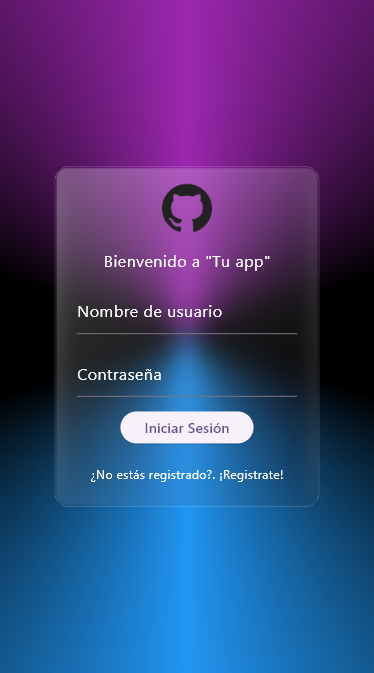
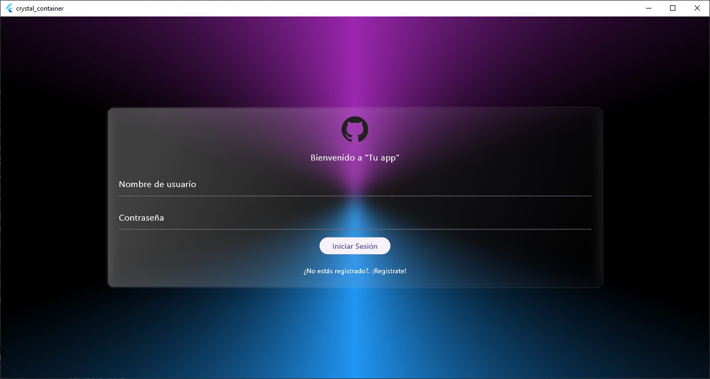

# Glass container

This is a simple widget to get a glass container, it is responsive and uses the size of the parent widget.

Only child param is required.

## Preview

📱 mobile preview

🖥️ desktop preview

## Using

Only call to GlassContainer(child: child). Remember: child is required.

Thanks for checking out this project!. Regards.
## About me
If you want to see more projects go to my [Github](https://github.com/Laztef) ♥